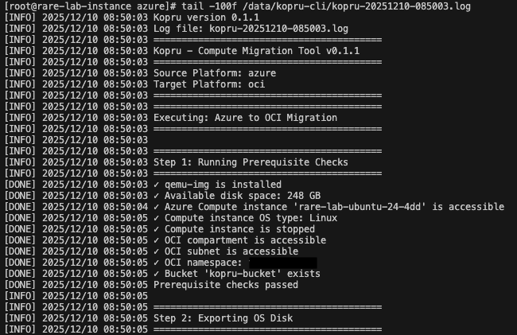

# Kopru
Kopru is a command-line tool written in Go that automates the migration of Compute instances to Oracle Cloud Infrastructure (OCI). While manual migration through the OCI console is possible, it quickly becomes cumbersome and error-prone when handling multiple instances or intricate setups. Kopru simplifies this process by providing an extensible, repeatable workflow that accelerates and standardises Compute instance imports into OCI.

## Features

- **Simple CLI**: Start a migration with just a few parameters.
- **Go Implementation**: Built with Go, using Cobra and Viper for CLI and config management.
- **Native SDK Integration**: Uses official Azure and OCI Go SDKs for authentication and performance. 
- **Workflow Resume**: `--skip-*` flags let you bypass completed steps and resume migrations.
- **OpenTofu Support**: Generates OpenTofu (Terraform-compatible) templates for OCI deployments.
- **Extensible & Open Source**: Easily adaptable for new platforms and OSes.

## Supported Configurations

 Kopru have been tested using the Azure platform images listed below:

- **Source Platform**: (more platforms coming soon)
  - Microsoft Azure 
- **Operating System**: (more OSes coming soon)
  - Ubuntu 22.04 LTS (x86_64) 
  - Ubuntu 24.04 LTS (x86_64 and ARM)
  - Debian 13 Trixie (x86_64)
  - Red Hat Enterprise Linux 9.4 (x86_64)
  - Windows Server 2022 Datacenter
  - Windows Server 2019 Datacenter  
- **Execution Environment**: Oracle Linux 9 in OCI
- **Target Platform**: Oracle Cloud Infrastructure

If your source VM has data disks attached, Kopru will automatically migrate and reattach them in OCI. For seamless operation, ensure your data disks are mounted using UUIDs or LVM rather than device paths (e.g., `/dev/sdb1`). If device paths are used, you may need to update `/etc/fstab` after migration to reflect the new device mappings in OCI.

## Quick Start

1. Check virtio drivers in the source OS 

Before migrating, ensure that the source OS has virtio drivers installed.

- **Ubuntu/Debian**: Virtio drivers are included by default, but always good to verify.
  
  To check if virtio drivers are compiled into the kernel, run:
  ```bash
  sudo grep -i virtio /boot/config-$(uname -r)
  ```

  To check if virtio drivers are included in initramfs, run:
  ```bash
  sudo lsinitrd /boot/initramfs-$(uname -r).img | grep virtio
  ```

- **Red Hat/CentOS**: Virtio drivers are included by default, but not included in initramfs by default. 

  You may need to rebuild initramfs to include them, run:
  
  ```bash
  KERNEL_VERSION=$(uname -r)
  INITRAMFS_PATH="/boot/initramfs-${KERNEL_VERSION}.img"
  sudo dracut -v -f --add-drivers "virtio virtio_pci virtio_scsi" "$INITRAMFS_PATH" "$KERNEL_VERSION"
  ```

- **Windows**: Install the Virtio drivers by following the instructions [here](https://docs.oracle.com/en/operating-systems/oracle-linux/kvm-virtio/kvm-virtio-InstallingtheOracleVirtIODriversforMicrosoftWindows.html).

1. Launch an Oracle Linux 9+ instance in OCI: 

See [OCI documentation](https://docs.oracle.com/en-us/iaas/Content/Compute/Tasks/launchinginstance.htm).

2. Clone this repository:
  
Clone the Kopru CLI repository and navigate into it.  

  ```bash
  dnf install -y git
  git clone https://github.com/codebypatrickleung/kopru-cli.git
  cd kopru-cli
  ```

3. Set up the environment:
  
The setup script installs dependencies like Go, qemu-img, and OpenTofu.

  ```bash
  chmod +x ./scripts/setup-environment.sh
  bash ./scripts/setup-environment.sh
  ```

4. Build the binary:

Build the Kopru CLI binary. 

  ```bash
  go build -buildvcs=false -o kopru ./cmd/kopru 
  ```
5. **Authentication Setup**

Kopru does not manage authentication itself. You must configure authentication for both Azure and OCI using official SDK or CLI tools, just as you would for other CLI utilities. For Azure, Kopru requires the `Disk Snapshot Contributor` and `Reader` roles on the VM's resource group. For OCI, ensure your user or group has the necessary IAM policies for the target compartment.

  - **Azure**: Kopru uses `Service Principal` for Azure authentication. See [Azure Authentication doc](https://learn.microsoft.com/en-us/azure/developer/go/sdk/authentication/authentication-on-premises-apps). Set:
    ```bash
    export AZURE_TENANT_ID="your-tenant-id"
    export AZURE_CLIENT_ID="your-client-id"
    export AZURE_CLIENT_SECRET="your-client-secret"
    export AZURE_SUBSCRIPTION_ID="your-subscription-id"
    ```
  - **OCI**: Kopru uses `API Key-Based Authentication` for OCI authentication. See [OCI Authentication doc](https://docs.oracle.com/en-us/iaas/Content/API/SDKDocs/cliinstall.htm#configfile). Essentially, you just need to run `oci setup config`, and this config file will be used by Kopru as well as OpenTofu(or Terraform) automatically. 

6. Run Kopru using one of these methods:

Step 1-5 are the hardest part! Now, run Kopru to start the migration. There are three ways to provide Kopru with the required parameters: environment variables, command-line flags, or a configuration file. There are only a few required parameters, which essentially identify the source Azure resource group/VM and target OCI compartment/subnet. So basically, just tell Kopru what Azure VM to migrate and where to put it in OCI. Here's an example using environment variables:

  - **Environment variables**:
    ```bash
    export AZURE_COMPUTE_NAME="azure-vm"
    export AZURE_RESOURCE_GROUP="azure-vm-rg"
    export OCI_COMPARTMENT_ID="ocid1.compartment.oc1..."
    export OCI_SUBNET_ID="ocid1.subnet.oc1..."
    export OCI_IMAGE_OS="Ubuntu"
    export OCI_IMAGE_OS_VERSION="24.04"
    export OCI_REGION="us-ashburn-1"
    export OCI_IMAGE_ENABLE_UEFI=true  # Set to true for Windows Gen2 or ARM VMs; otherwise, leave as false (default).
    ./kopru &
    ```

For a full list of parameters, see `./kopru --help` or refer to the [Configuration Parameters](kopru-config.env.template) document.

7. **Manual OpenTofu Deployment** (if auto-deployment was skipped):

This is an optional step as the tool can auto-deploy the generated template. If you used `--skip-template-deploy`, navigate to the `template-output` directory and run OpenTofu commands to deploy the generated template:

  ```bash
  cd ./template-output
  tofu init
  tofu plan
  tofu apply
  ```

If you prefer Terraform, the generated templates are compatible. Just replace `tofu` with `terraform` in the commands above. OpenTofu is a fork of Terraform that has a fully open-source core, and is part of the Linux Foundation. The generated templates maintain compatibility. 

## Additional Resources

- **Logging**:
Kopru creates a log file in the current directory named `kopru-<timestamp>.log`. Logs are shown in the console and saved for review. 

  
  
- **OS Configurations**:
  All the OS-specific configurations used by Kopru CLI during image migration are written in bash script files located in the `scripts/os-config/` directory. There are several benefits to using bash scripts for OS configurations:

  - **Easier maintenance**: Bash scripts are easier to modify and test independently
  - **Better separation of concerns**: Any changes to the VM are isolated from the Go application
  - **Flexibility**: New OS configurations can be added by simply editing the scripts without changing the Go code
  - **Transparency**: Configuration changes are more visible and auditable 

## Conclusion

That's it! Hopefully this guide helps you get started with Kopru for your cloud migrations to OCI. As with all migration, ensure health checks and testing are performed post-migration to validate success. For more details, please feel free to connect with me on [LinkedIn](https://www.linkedin.com/in/pgwl/) or GitHub. Happy migrating! 
